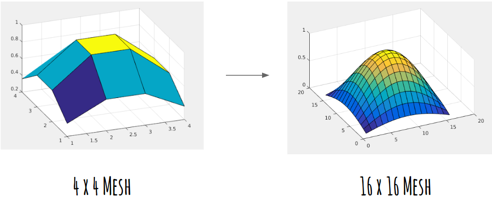

# matlab-preconditionCG
Using a coarse mesh to precondition a CG solver on refined mesh

Details about this project can be found in the [presentation](https://docs.google.com/presentation/d/1rv75wlB4Q5sDYFlpKYuWn36LZhYspQ5dPFens4RR1uc/edit?usp=sharing)

